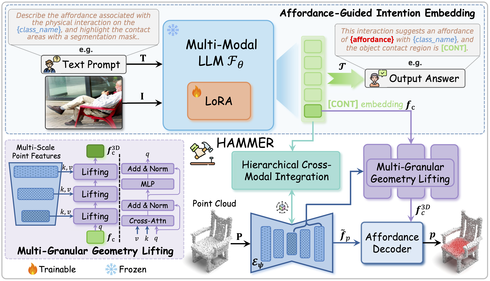

<div align="center">

#  HAMMER: Harnessing MLLMs via Cross-Modal Integration for Intention-Driven 3D Affordance Grounding
**CVPR 2026**

[Lei Yao](https://rayyoh.github.io/), [Yong Chen](https://openreview.net/profile?id=~Yong_Chen22), [Yuejiao Su](https://openreview.net/profile?id=~YUEJIAO_SU1), [Yi Wang](https://wangyintu.github.io/), [Moyun Liu](https://lmomoy.github.io/), [Lap-Pui Chau](https://www.eie.polyu.edu.hk/~lpchau/)

<a href="https://arxiv.org/abs/2602.xxxxx"></a>
<a href="https://rayyoh.github.io/Hammer/"></a>
<a href="https://github.com/pre-commit/pre-commit">
<a href="https://huggingface.co/RayYoh/Hammer">
<a href="LICENSE">
</div>

## :memo: To-Do List
- [x] Environment installation instructions.
- [ ] Instructions for processing dataset.
- [x] Release trained weights.
- [x] Release training code.
- [x] Release evaluation code.

## 🌟 Pipeline



## :ladder: Installation
```bash
# For CUDA 11.8
conda create -n hammer python==3.10
conda activate hammer

# requirements.txt is generated by wandb; 
# if issues occur, manually install missing packages or contact the author.
pip install -r requirements.txt

# Alternative method to install pointnet2_ops and KNN_CUDA
pip install "git+https://github.com/erikwijmans/Pointnet2_PyTorch.git#egg=pointnet2_ops&subdirectory=pointnet2_ops_lib"
pip install --upgrade https://github.com/unlimblue/KNN_CUDA/releases/download/0.2/KNN_CUDA-0.2-py3-none-any.whl


# For CUDA 12.8
conda create -n hammer python==3.12
conda activate hammer

pip install torch==2.8.0 torchvision==0.23.0 torchaudio==2.8.0 --index-url https://download.pytorch.org/whl/cu128
pip install wandb tensorboard peft deepspeed scikit-learn
pip install transformer==4.54.1
```

## :mag: Data Preprocessing 
Coming soon.

## :rocket: Training
```bash
# -d for datasets, -p for splits, -g for GPU nums, 
# -l for learning rate, -e for epoches, -n for name
# for more details, see scripts/train.sh
bash scripts/train.sh -d PIADv1 -p Seen -g 4 -b 64 -l 0.0001 -e 30 -n exp1
```

## :flying_saucer: Inference
```bash
bash scripts/eval.sh
```

## :books: License
This repository is released under the [MIT license](LICENSE).

## :clap: Acknowledgement
The research work described in this paper was conducted in the JC STEM Lab of Machine Learning and Computer Vision funded by The Hong Kong Jockey Club Charities Trust. This research received partially support from the Global STEM Professorship Scheme from the Hong Kong Special Administrative Region.

Our code is primarily built upon [GLOVER](https://teleema.github.io/projects/GLOVER/), [VLMSAM](https://github.com/QuentinFitteRey/VLMSAM) and [GREAT](https://github.com/yawen-shao/GREAT_code).

## :pencil: Citation

```bib
@article{yao2026hammer,
  title={HAMMER: Harnessing MLLMs via Cross-Modal Integration for Intention-Driven 3D Affordance Grounding},
  author={Yao, Lei and Chen, Yong and Su, Yuejiao and Wang, Yi and Liu, Moyun and Chau, Lap-Pui},
  journal={arXiv preprint arXiv:2602.xxxxx},
  year={2026}
}
```